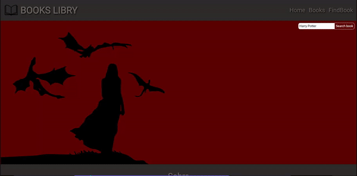
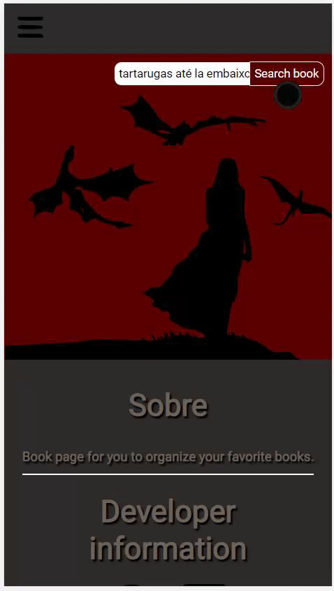
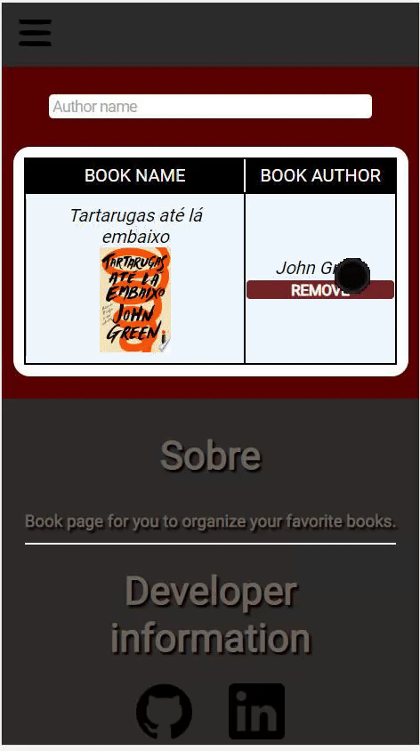

    
    
    
  

<h1>App to organize books</h1>

<h2 align='center'>Application to organize your books that consumes the Google Books API.</h2>
 

This app was made in order to train my skills in React/Vite.

<h1 align="center">
    <a href="https://vitejs.dev/">🔗 Vite</a>
</h1>
 

🚀lib to build UIs with reusable components.

<h2>🛠 Technologies</h2>

<h3>The following tools were used in building the project:</h3>

<ul>
    <li><a href="https://react-redux.js.org/">React Redux</a> - for application State control.</li>
    <li><a href="https://reactrouter.com/en/main">React Router</a> - for controlling routes.</li>
    <li><a href="https://stitches.dev/">Stitches</a> - for styling the application with CSS-in-JS.</li>
    <li><a href="https://axios-http.com/ptbr/docs/intro">Axios</a> - for API consumption.</li>
</ul>

<h2 align="center">🎨 Preview from App:</h2>
 

  

    <h2 align="center">🎨 Preview from Mobile:</h2>
    
    

  
<h1>Author</h1>

 
<b>Danilo Gomes</b></a> 

Feito com ❤️ por Danilo Gomes 👋🏽 Entre em contato!

